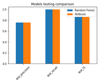

# Adaptive-Malicious-Detector-on-a-Kafka-Stream
## OverView
Soon...

## Dataset
Soon...

## Methodology
Soon...

## Installation instructions:

To achieve the real time data delivery, I used Kafka and Dockers to 
simulate an independent server which will send information.

1. To install the local Docker and Docker Compose programs on our 
computers. Please use the following link to download it just take into consideration your operative 
system. https://docs.docker.com/get-docker
2. Once your installation is complete, you will have the docker’s desktop interface as shown 
in the following image. It is not necessary to create an account or to perform any upgrade, 
with the free version we will be able to complete the assignment
3. Once it is fully installed download and unzip the folder provided that contains the scripts 
and the .csv with the data.

Once unzipped in your computer, run one of the following files depending on your 
operative system:
- If you are using windows then run the docker_script.bat file 
- Otherwise run the docker_script.sh file on Linux/MacOS

This file will create two docker images wurstmeister/kafka and wurstmeister/zookeeper. 
For this activity you don’t have to worry about what they are or how they run, as everything 
is already configured. At the end of the installation

To validate that the container images were created successfully open Dockers and you 
should see two images running like this

Now you are ready to capture the data stream and start the data treatment for your model. 

## EDA
### Validate data imbalanced with justifications
The dataset is slightly imbalanced as there is a difference of 10% between the false and true classes.

### Statistical analysis of data
Feature distributions

| Histograms               | Boxplots (for outliers and skewness) |
|--------------------------|--------------------------------------|
|   |               |

Skewness

| Right skew feature using KDE | Right skew feature using KDE | Statical skewness scores |
|------------------------------|------------------------------|--------------------------|
|       |       |   |

- The highly negative score represents the left skew, and the positive represents the right skew. 

### Data Cleansing and Feature creation
I have found 8 missing values in the longest_word, I dropped them as letters so we would realize this feature is not important, so I decided to simplify the final pipeline by dropping the missing ones instead of using imputer.

| Check Nulls             | Check Unique            |
|-------------------------|-------------------------|
|  |  |

We have 3 object features:
- The timestamp would be dropped because by intuition it is not a time series problem
- longest word and sld would be encoded using feature hasher instead of one hot representation due to many unique values in both.

Finally, I applied MinMaxScaler to the dataset to keep the distribution as its but in a unified range, I didn’t use the stander scaler as chi-square requires non-negative ranged variables.

## Work on the static model:

### Feature Filtering

| Chi-square test         | Mutual Info test           |
|-------------------------|----------------------------|
|  |     |
|Chi-square test scores indicate to have 6 important features|     Mutual Info test scores fail to have a clear indication of the most important feature as the scores are so near                       |

### Feature selection using tree-based models

| Check Nulls              | Check Unique             |
|--------------------------|--------------------------|
|  |  |

-	The final set of features: I would select 6 out of the 20 features, which include the highest significant 6 feature in chi-square, as they include the most important features for both the random forest and XGBoost algorithms feature importance.
Compare the models before and after feature selection
 
-	As shown in the below comparison, the training time and inference time were reduced while the metric are almost the same after the feature selection so I selected the reduced features.

**Compare the models before and after feature selection**

| Classification Metric    | Timing Metric            |
|--------------------------|--------------------------|
|  |  |
|  |  |
|  |                          |

### Data Splitting and justification
I would split the dataset into train, validation, and test by 70%, 15%, and 15% percentage respectively
-	Train: To fit the normalizer (Scaler) and train the models using the cross-validation method on this set to evaluate the model’s stability and robustness accurately and efficiently without data leakage.
-	Test: To evaluate and compare the final models.
-	Validation: To select the features and apply the hyperparameter tuning on the models.

### Choose and justify the correct performance metric
I have chosen the F1-Score as a metric to handle the small imbalance in the data while compromising between precision and recall as both are important in this problem, I don’t need to catch all the hacks while having a lot of false alarms (False Positive), and I don’t need to miss a lot of attacks while trying not to produce false alarms so I have chosen F1-score compromise between them.
Hyperparameter tuning is correct and clear
-	I used the grid search technique to select the best hyperparameters for the models, which are Random Forest and XGBoost to select the best n_estimators and max_depth that achieve the highest f1-score over the validation set to avoid data leakage.

### Compare and describe the two models you will use
From the three graphs below:
-	F1-score, Precision, and Recall score for XGBoost and Random Forest are almost the same
-	The random forest takes less time for training than XGBoost.
-	The XGBoost takes less time for inference than the random forest.

### Plot the models’ results

| Right skew feature using KDE  | Right skew feature using KDE  | Statical skewness scores |
|-------------------------------|-------------------------------|--------------------------|
|       |       |  |

### Discuss and analyze the results
So, for static models, it's better to choose the XGBoost as it's faster at inference time and only trains once, but for the dynamic model, it's better to choose the random forest as it has less training time, especially as the training set increases with time and require multiple training iterations.

## Work on the Dynamic model

### Windows use 1,000 datapoints
I have implemented a function that reads n records from the consumer, then transforms them into the standard string, splits them by commas, then reads them into data frames, and returns them as a pandas’ data frame.

### Training reevaluation process is clearly described
Static and dynamic models were evaluated based on the most recent 1000 records, only which were observed by the window function from the producer.

The trigger for retraining the dynamic model depends on the F1-score as I have chosen 85% as a threshold, So, if the F1-score drops under 85%, retrain the dynamic model as by plotting the static f1-scores alone, I have found most of the batches get above 85%, So, I retrain the model if the F1-score dropped under the threshold trying to maintain good performance.
I have compared 2 training approaches:
-	The first one to retrain on the Kafka accumulative batches of the dynamic data only.
-	In the second approach I appended the arrived Kafka batches to the static dataset and retrain the whole set which contains the static & the accumulated Kafka batches.

### Correct performance metrics are selected and justified
As stated above, I have chosen the F1 score to compromise between both the precision and recall scores equally.
### Static and Dynamic models are evaluated
I have evaluated both models for each window batch, by calculating the F1 score and appending the scores in a list to be plotted below.

### Plot the results obtained for both models
| Retrain on the accumulative streams only   | Retrain on the accumulative streams with static data |
|--------------------------------------------|------------------------------------------------------|
|                    |                              |

### Analyze the results obtained for both models
By retraining on the arrived batches only, I noticed that at the beginning the static model performs slightly better than the dynamic model till the dynamic data become significant, then the dynamic model overcomes the static one dramatically starting from batch number 75.
By retraining on the arrived batches concatenated with the static data, I have found that the difference between the dynamic and static model at the beginning is very small and that makes sense as the static data are most dominant at the beginning but with time while the dynamic data become significant the difference appears significantly. Also, we noticed that in most cases when the f1-score is below the threshold, after retraining the dynamic model performs better than the static one, also the static model performs better in 4/267 while the dynamic performs better on 28/267 and In between they provide close performance.

### Advantages/limitations and knowledge learned is clear and correct
The static models have very well performance if the upcoming streams are from the same distribution of the trained data, but if the data has drifted over time, then the static model performance would be dropped especially for classical machine learning models.

|             | Static model                                                   | Dynamic model                                         |
|-------------|----------------------------------------------------------------|-------------------------------------------------------|
| Train       | Offline training is done once (advantage)                      | Online training is done multiple times (weakness)     |
| Data drift  | Not adaptive (weakness)                                        | Adaptive (advantage)                                  |
| Labeling    | Once (advantage)                                               | Continuous (weakness)                                 |
| Difficulty  | Easy to build and test as all things are done once (advantage) | Harder and require continuous provisioning (weakness) |

